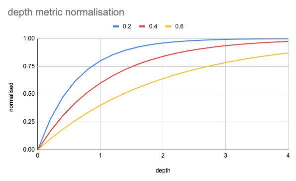

# PR Engagement Metrics

A powerful CLI tool for analyzing team engagement patterns on GitHub pull requests.

[](https://www.npmjs.com/package/pr-engagement-metrics)
[](https://opensource.org/licenses/MIT)

## 🌟 Features

- **Comprehensive Engagement Metrics**: Track both depth (comments/PR) and breadth (% of PRs reviewed) of engagement
- **Configurable Weighting**: Adjust importance of depth vs. breadth based on team priorities
- **Rich Visualizations**: Clear tables showing engagement patterns with sorting options
- **Detailed Reports**: Optional debug mode for deep dives into individual behaviors
- **Self-comment Filtering**: Automatically excludes comments on one's own PRs
- **Cross-platform**: Works on macOS, Linux, and Windows

## 📊 Why Track Engagement?

Understanding team engagement helps:

- Identify review bottlenecks
- Balance workload across team members
- Encourage collaboration on PRs
- Recognize top contributors
- Improve team review practices

## 📦 Installation

```bash
# Install globally
npm install -g pr-engagement-metrics

# Or run directly with npx
npx pr-engagement-metrics
```

## 🔑 Setup

Create a GitHub personal access token with `repo` permissions at [GitHub's token settings](https://github.com/settings/tokens).

Set it as an environment variable:

```bash
# For macOS/Linux
export GITHUB_TOKEN=your_github_token_here

# For Windows PowerShell
$env:GITHUB_TOKEN="your_github_token_here"
```

## 🚀 Usage

```bash

# Specify organization and repository
pr-engagement-metrics --org your-org --repo your-repo

# Look back more days
pr-engagement-metrics --days 14

# Prioritize breadth over depth (values > 1.0 prioritize breadth)
pr-engagement-metrics --weight 1.5

# Adjust the rate at which increased depth has reduced impact on overall metric
pr-engagement-metrics -s 0.6

# Show detailed breakdown per user
pr-engagement-metrics --debug
```

### Options

```
Options:
  -o, --org <org>                                          GitHub organization
  -r, --repo <repo>                                        GitHub repository
  -t, --days <days>                                        Number of days to look back (default: "5")
  -w, --weight <weight>                                    Weight for engagement breadth (>=0.25) (default: "3.0")
  -s, --depth-diminishing-factor <depthDiminishingFactor>  The rate at which importance of ever-increasing depth diminishes (>0 <1) (default: "0.7")
  -d, --debug                                              Enable debug output with detailed activity
  -n, --with-names                                         Include names in the report (default is anonymised)
  -h, --help                                               Display help for command
```

## 📋 Sample Output

```
==================================================================================
        REPORT 7 DAYS FROM 2025-05-12T07:06:07.410Z
==================================================================================
┌──────────────────────┬──────────┬───────────┬────────────────────────┬────────────────────┬────────────────┐
│ User                 │ Comments │ Approvals │ Depth (s=0.4)          │ Breadth (w=3)      │ Combined       │
├──────────────────────┼──────────┼───────────┼────────────────────────┼────────────────────┼────────────────┤
│ #######              │ 25       │ 19        │ 2.20 (44/20) → 0.87    │ 0.69 (20/29)       │ 0.73           │
├──────────────────────┼──────────┼───────────┼────────────────────────┼────────────────────┼────────────────┤
│ #######              │ 11       │ 17        │ 1.75 (28/16) → 0.80    │ 0.59 (16/27)       │ 0.64           │
├──────────────────────┼──────────┼───────────┼────────────────────────┼────────────────────┼────────────────┤
│ #######              │ 23       │ 9         │ 3.20 (32/10) → 0.95    │ 0.33 (10/30)       │ 0.49           │
├──────────────────────┼──────────┼───────────┼────────────────────────┼────────────────────┼────────────────┤
│ #######              │ 4        │ 9         │ 1.63 (13/8) → 0.77     │ 0.32 (8/25)        │ 0.43           │
├──────────────────────┼──────────┼───────────┼────────────────────────┼────────────────────┼────────────────┤
│ #######              │ 11       │ 6         │ 2.13 (17/8) → 0.86     │ 0.24 (8/33)        │ 0.40           │
└──────────────────────┴──────────┴───────────┴────────────────────────┴────────────────────┴────────────────┘
```

### With Debug Mode

```
>> User: john-developer
   === APPROVED PRs ===
   - PR #123 (author=bob-engineer): https://github.com/your-org/your-repo/pull/123
   - PR #127 (author=alice-coder): https://github.com/your-org/your-repo/pull/127
   
   === COMMENTS ===
   - PR #123 (author=bob-engineer): 4 comments - https://github.com/your-org/your-repo/pull/123
   - PR #127 (author=alice-coder): 6 comments - https://github.com/your-org/your-repo/pull/127
```

## 📊 Understanding the Metrics

- **Engagement Depth**: Average comments & approvals per PR
  - Formula: `(comments + approvals) / non-authored PRs`
  - High values indicate thorough reviews

- **Engagement Breadth**: Percentage of PRs a person engages with
  - Formula: `unique PRs interacted with / non-authored PRs`
  - High values indicate wide coverage

- **Engagement Score**: Combined metric with configurable weighting
  - Formula: `((1 - depthDiminishingFactor^depth) + (breadth * breadthWeighting)) / (1 + breadthWeighting);`
  - Weighted average of depth vs breadth (with increased depth having diminishing returns to a configurable degree)

## 🧠 Strategic Uses

1. **Set team expectations**: "Everyone should aim for engagement breadth of at least 0.5"

2. **Balance workloads**: Identify who's carrying review burden vs. who needs to increase participation

3. **Analyze patterns**: 
   - High depth, low breadth → Concentrating on few PRs
   - Low depth, high breadth → Superficial reviews of many PRs
   - High on both → Great contributor
   - Low on both → Limited participation

4. **Optimize for team size**:
   - Small teams: Lower weight (emphasize depth)
   - Large teams: Higher weight (emphasize breadth)

## 🔧 Advanced Configuration

### Weight Recommendations

- **0.5**: Heavily favor engagement depth (quality over quantity)
- **1.0**: Equal weight to depth and breadth
- **2.0**: Favor breadth (incentivize looking at more PRs)
- **3.0**: Strongly favor breadth (maximize PR coverage)

### Depth Normalization
The formula `1 - Math.pow(depthDiminishingFactor, depth)` converts our unbounded `depth` metric to a 0-1 scale with diminishing returns. The `depthDiminishingFactor` (between 0-1) controls how quickly the value approaches 1 as depth increases. Smaller factors create steeper curves that reward fewer interactions, while larger factors produce more gradual curves that require sustained engagement to achieve high scores. This ensures additional interactions always improve the score while preventing any single highly-active review from dominating the metric.

The below chart demonstrates the effect of three difference values of `depthDiminishingFactor` on this metric:



## 🛡️ License

MIT

## 🤝 Contributing

Contributions welcome! See our [contribution guidelines](CONTRIBUTING.md).

## 📝 Changelog

See [CHANGELOG.md](CHANGELOG.md) for details on each release.

## 💻 Requirements

- Node.js v14 or higher
- GitHub Personal Access Token with repo permissions
